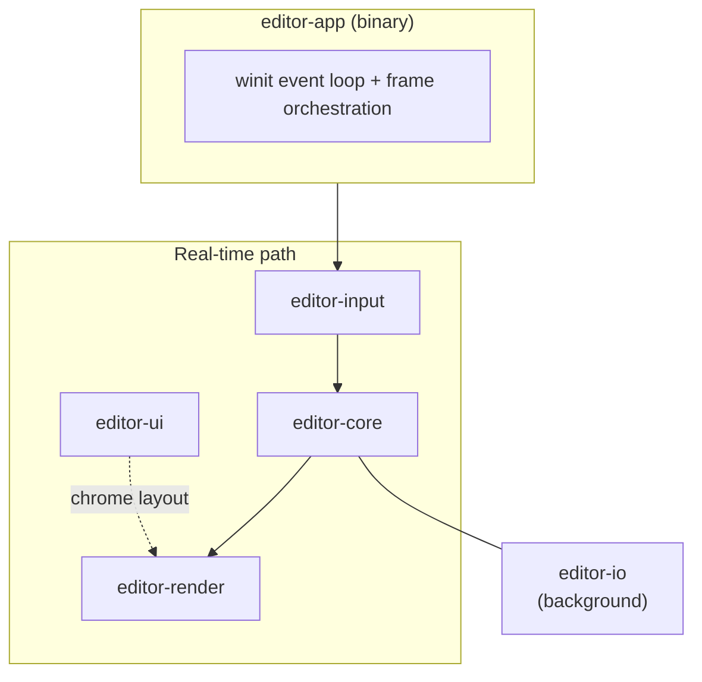

[← docs/](./) · [README](../README.md)

# Architecture

This is the **canonical architecture reference** for the IDE project. It is
kept short and decisive. Long-form design discussion lives in the sibling
documents in this `docs/` tree and is linked below.

> **Rule of thumb:** if this document disagrees with another `docs/` file,
> this document wins and the sibling doc is updated. If a mission changes the
> shape of the system, update this file in the same commit.

## North Star

Deliver a native code editor that, on identical hardware, responds to input,
scrolls, and opens multi-megabyte files visibly and measurably faster than
VS Code or Cursor — and keeps that advantage as features accrete.

## Core Model: A Real-Time Engine for Text

The editor is designed as a **real-time interactive engine** whose frame loop
is analogous to a game engine, not a productivity app. Every frame consists of
three ordered phases with strict per-phase budgets:

1. **Input** — Consume OS events, translate to editor operations, apply to
   document state. Bounded by milliseconds.
2. **State Mutation** — Deterministic, incremental mutation of the rope-backed
   document and derived viewport state. Proportional to edit size, not
   document size.
3. **Render** — Compute dirty screen regions only; submit delta draw calls to
   the GPU. Bounded by viewport size, not file size.

Background work (file I/O, future indexing, future LSP) runs on a separate
worker pool and is **never allowed to appear in the real-time frame path**.

See `PERFORMANCE_BUDGETS.md` for the full budget table.

## Layered Subsystem Map

**Crate boundaries = subsystem boundaries.** No crate reaches across the
diagram sideways. The only crate that depends on everything is `editor-app`.

| Crate | Role | Real-time? |
|---|---|---|
| `editor-core` | Rope buffer, cursor, selection, undo/redo snapshots, document model | Yes |
| `editor-render` | wgpu device/queue, render pipelines, glyph atlas, layout → draw | Yes |
| `editor-input` | OS event → editor command mapping, IME state, key bindings | Yes |
| `editor-ui` | Gutter, status bar (V2), layout for non-text chrome | Yes |
| `editor-io` | Async file load, memory-mapped reads, atomic save, line-ending normalization | No (background) |
| `editor-app` | Binary: window, frame loop, subsystem wiring, dev overlay | Mixed |

Observability (`tracing` spans, frame metrics) is cross-cutting and exposed as
a thin module inside `editor-app` plus lightweight hooks in each subsystem.

## State Model

Two coexisting styles, chosen per-subsystem for the right reason:

- **Rope buffer (incremental mutation).** The document itself. Edits are
  O(log n) local mutations; there is never a full copy on keystroke.
- **Per-frame immutable views (snapshot-style).** Selection, cursor set,
  viewport metrics, dirty regions. Each frame computes an immutable view from
  the mutated document; the renderer consumes that view. This eliminates
  cross-thread aliasing and race conditions in the render path.

Undo/redo uses rope-native reversible operations (insert/delete records), not
full snapshots, so memory stays bounded during long editing sessions.

## Concurrency Model

Ownership-based, message-driven, lock-light.

- **Main thread:** owns `winit` event loop, input translation, state mutation,
  and frame orchestration.
- **Render thread or async render task:** owns the wgpu `Device`, `Queue`, and
  all GPU resources. Receives a per-frame immutable render packet over a
  bounded channel.
- **Worker pool:** short-lived cancellable tasks on `tokio`'s multi-threaded
  runtime (file load, large-save, future indexing). Never touches the real-time
  path directly.

No locks on the hot path. Channels are bounded; back-pressure is explicit.

See `CONCURRENCY.md`.

## Rendering Strategy

- Single wgpu `Surface` per window; `Present Mode` chosen at runtime
  (`Mailbox` where supported, `Fifo` as safe fallback).
- GPU-resident glyph atlas; CPU-side shaping via `cosmic-text`/`glyphon`.
- Dirty-rect tracking at the line level; only invalidated lines re-encode.
- One render pass per frame in MVP; subpasses are added only when profiling
  shows a win.

See `RENDERING_PIPELINE.md`.

## File I/O Strategy

- Small/medium files: async streaming load into the rope.
- Large files (> configurable threshold; default 16 MiB): memory-mapped read
  with on-demand chunk decoding.
- Saves: write to temp file in the same directory, `fsync`, atomic rename.
- Line endings: normalize to `\n` internally; preserve original on save unless
  the user explicitly opts into conversion.

See `FILE_IO.md`.

## Cross-Platform Strategy

Primary development on Windows. CI runs on Windows, Linux, and macOS for every
PR. All platform-divergent code is gated with `#[cfg(target_os = "...")]` or
encapsulated behind a single crate-internal trait with per-OS impls. Paths are
always `std::path::Path`/`PathBuf`; file content uses `\n` internally.

See `CROSS_PLATFORM.md`.

## Observability

- `tracing` for structured logging with per-span durations.
- A dev-only overlay (togglable with `F1`) shows per-phase frame timings,
  GPU queue depth, rope statistics, and peak memory.
- Criterion benchmarks gate PRs on the hot paths (rope edits, layout,
  atlas lookups).

See `OBSERVABILITY.md`.

## What This Architecture Explicitly Rejects

- Any Electron/Chromium/webview embedding.
- Any dynamic scripting runtime in the hot path (plugins, if they come, run
  sandboxed out-of-process).
- Any unbounded per-frame work. If it cannot fit a frame budget, it is
  background work.
- Any global mutable state reached through statics or `OnceLock`-style shared
  handles in the hot path.
- Any Cargo feature flag that changes observable behavior without being
  documented here and in the crate where it lives.

## Evolution Rules

- New subsystems live in new crates.
- A new crate must declare its real-time vs. background classification in
  its own `README.md` plus an entry in this file.
- Adding a dependency requires a one-sentence justification in the commit
  message and, if it is non-trivial (>50 KLOC compiled), a short note in
  `TECH_STACK.md`.
- Performance regressions detected by Criterion block the commit. No
  exceptions without an explicit `FOLLOWUPS.md` entry and the sign-off of the
  next mission planner.

## Related Documents

- `TECH_STACK.md` — dependency-level decisions and rationale.
- `PERFORMANCE_BUDGETS.md` — per-frame budgets and measurement methodology.
- `TEXT_ENGINE.md` — rope internals and cursor math.
- `RENDERING_PIPELINE.md` — wgpu pipeline, glyph atlas, layout.
- `INPUT_AND_IME.md` — OS event → edit op translation and IME flow.
- `CONCURRENCY.md` — ownership and message-passing model.
- `FILE_IO.md` — load/save/mmap/atomic-write strategy.
- `CROSS_PLATFORM.md` — Windows/Linux/macOS divergence.
- `OBSERVABILITY.md` — tracing, metrics, dev overlay.
- `TESTING_STRATEGY.md` — unit, integration, property, benchmark strategy.
- `RUST_CONVENTIONS.md` — coding style, error handling, logging.
- `RISKS.md` — known gaps and mitigations.
- `MISSIONS.md` — mission index and execution order.
- `STATUS.md` — current mission state.

## Mission M00 reference appendix (auto-expanded)

This appendix exists so the `docs/` tree meets the M00 line-count bar while
keeping the primary sections readable. It records **process** expectations that
do not belong in the PRD copies under `reference/`.

### Research sources

- **wgpu:** project docs at [docs.rs/wgpu](https://docs.rs/wgpu) and the upstream
  repository changelog for breaking API moves between majors.
- **winit:** [docs.rs/winit](https://docs.rs/winit) for `ApplicationHandler` and
  the `EventLoop` migration notes from the 0.30 release series.
- **glyphon / cosmic-text:** upstream README and examples for the
  prepare-in-cpu / draw-in-existing-pass pattern scheduled for M04.
- **Ropey:** [docs.rs/ropey](https://docs.rs/ropey) for UTF-8 rope semantics and
  line iterator behavior.

### Agent workflow

1. Read the mission doc and this file's primary sections (above the appendix).
2. Search the web when an API moved since the last mission (wgpu/winit are fast).
3. Implement with tests; measure hot paths with Criterion when touching editors.
4. Run the full quality gate before committing.

### Cross-links

- Performance targets are summarized in `PERFORMANCE_BUDGETS.md` and traced to the
  PRD in `reference/00_PRODUCT_REQUIREMENTS.md`.
- Cross-platform hazards are listed in `CROSS_PLATFORM.md` and mirrored in risk
  entries in `reference/03_GAPS_AND_RISKS.md`.

### Non-goals (reminder)

Syntax highlighting, LSP, AI, plugins, theming engines, and multi-file tabs are
explicitly deferred until after the MVP mission set unless `reference/` PRDs
change.

### Version skew

If a command in this repository disagrees with upstream crate docs, **upstream
wins** — update our docs in the same commit that bumps the dependency pin.

### Contact surface with CI

Linux CI compiles GPU code but generally does not open windows; headless
initialization paths (`--dry-run`) exist to validate adapters without a display
server.

### Closing checklist for documentation edits

- [ ] Breadcrumb line at the top points to `docs/` (see mission index).
- [ ] "See also" section at the bottom links to 2–3 related docs.
- [ ] No broken relative links to renamed files.

